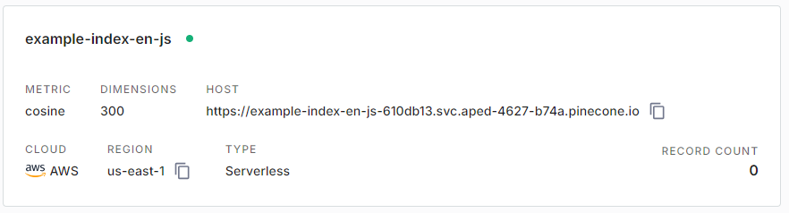

## Instalar Pinecone
npm install @pinecone-database/pinecone

## Instalar mammoth (Para el Documento de Word las inscrustaciones)
npm install mammoth

**Información:** https://docs.pinecone.io/guides/get-started/quickstart

## Creado el Index en Pinecone

Este es un proyecto increíble que hace cosas increíbles.

## Instalar Anaconda

**Información:** https://www.anaconda.com/installation-success?source=installer

conda create --name vectors_nodejs python=3.10.12

# To activate this environment, use
#
#     $ conda activate vectors_nextjs
#
# To deactivate an active environment, use
#
#     $ conda deactivate

**Ahora instalar las librerias**
pip install transformers==4.33.2
pip install onnxruntime==1.17.0
pip install optimum==1.13.2
pip install tqdm
pip install onnx==1.13.1
conda install requests

## Ir a la documentacion npm Hugging Face
**Información:** 
- npm i @huggingface/transformers
- npm i @huggingface/transformers

npm install @huggingface/inference
npm install @huggingface/hub
npm install @huggingface/agents

npm i -g @nestjs/cli
npm i @xenova/transformers
